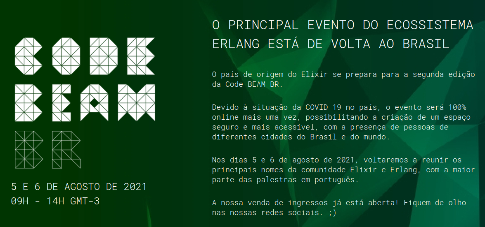

<!-- size: 16:9 -->
<!--
theme: default
paginate: true
-->
<!-- 
backgroundColor: lightpink 
header: 'Learning Elixir and Erlang with Advent of Code and Exercism: advantages and challenges'
footer: 'Adolfo Neto (UTFFPR)'
-->

# Learning Elixir and Erlang with Advent of Code and Exercism: advantages and challenges

## Adolfo Neto  [@adolfont on Twitter](http://twitter.com/adolfont)

[adolfont.github.io](http://adolfont.github.io)

<!-- https://twitter.com/TheErlef/status/1526616037684281344 -->

---

# Presentation script

- Who am I?
- What is Advent of Code?
- What is Exercism?
- What is good/bad in AoC/Exercism?
- **How ​​to use AoC and/or Exercism to learn Erlang and/or Elixir?**

---

# Who am I?

- Professor at the [Federal University of Technology – Parana (UTFPR)](http://www.utfpr.edu.br/english/about-utfpr/facts-and-figures)
- Co-host of [Elixir em Foco (Elixir in Focus)](https://www.elixiremfoco.com/) podcast (in Brazilian Portuguese)
- Member of the [Education, Training, & Adoption Working Group of the Erlang Ecosystem Foundation](https://erlef.org/wg/education)
- [YouTube EN](https://www.youtube.com/c/ElixirErlangandtheBEAMwithAdolfoNeto), [YouTube PT](https://youtube.com/c/AdolfoNeto), [Instagram](http://instagram.com/adolfont), [Telegram](http://t.me/adolfont), [GitHub](http://github.com/adolfont), [Twitch](http://twitch.tv/adolfont), [TikTok](https://www.tiktok.com/@adolfont)...

---

# Which are the difficulties in learning Elixir and Erlang?

- Common programming pitfalls
- Erlang/Elixir pitfalls
  - Functional programming concepts
  - Syntax details
  - Not knowing the best practices of the communities
  - Concurrency/OTP (difficult by itself)

---

## What helps? (in my opinion)

- Reading [books](https://dev.to/adolfont/the-elixir-community-owes-a-lot-to-pragmatic-programmers-glf) or well-structured materials ([Elixir School](https://elixirschool.com/en))
- Having a mentor
- Chatting with other people
- Participating in the community
	- [Elixir Forum](https://elixirforum.com/)
	- [Erlang Forums](https://erlangforums.com/)
	- \#MyElixirStatus, \#ElixirLang\, \#WeBEAMtogether, \#Erlang
	- [Elixir World](https://t.me/elixir_world)
- Listening to [podcasts](https://github.com/elixir-lang/elixir/wiki/Podcasts-and-Screencasts) 
- What else?

---

## What helps? (in my opinion)

- Putting knowledge into practice - just a little bit above your current level

- Write code idiomatically, the way more experienced people in the community write

---

# Which is most used? I don't know, but...

"Have you ever solved an Advent of Code or an Exercism challenge?"

"Have you ever solved a programming challenge from:"

- [Twitter Poll](https://twitter.com/elixiremfoco/status/1510973616602722308)
- [Poll on Elixir Forum](https://elixirforum.com/t/have-you-ever-solved-an-advent-of-code-or-an-exercism-challenge/46985)
- [Poll on Erlang Forums](https://erlangforums.com/t/have-you-ever-solved-an-advent-of-code-or-an-exercism-challenge/1285)
- [Sum](https://docs.google.com/spreadsheets/d/1COt5PrCVjm7hnNTBWC27UI9FsVr_qYOkkocWNZE1T5I/edit?usp=sharing)

---

# What is the Advent of Code?

- Website: [https://adventofcode.com/](https://adventofcode.com/)
- Wikipedia: [https://en.wikipedia.org/wiki/Advent_of_Code](https://en.wikipedia.org/wiki/Advent_of_Code)
- Creator: [Eric Wastl](http://was.tl/)

- Annual “event” that goes from December 1st to December 25th
  - It's a kind of competition
  - There are private leaderboards
  - What counts for the ranking is who finds the answer, usually a number, first
- So the time zone counts.

---

# Me in Advent of Code

- 2021: 1 to 10, 13 and 14 - total 12x2 = 24
- 2020: 1 to 9 and part 1 of day 10: total 19
- 2019: 1 and 2. Total: 4

Where am I saving my solutions as of 2021
https://github.com/adolfont/pensandoemelixir/tree/main/adventofcode/

---

# Important!

- Long description
- Pay close attention to the wording!
- Undisclosed difficulty
- Many ad-hoc solutions
    - Example: [Day 2 Part 1 2019](https://adventofcode.com/2019/day/2)

---

# What is Exercism?

- Created by [Katrina Owen](https://www.kytrinyx.com/)
    - read https://www.kytrinyx.com/exercism/ !!!
    - and https://en.wikipedia.org/wiki/Exercism

- Exercises + free mentoring
- It gives you descriptions and tests in one language
- Current version: version 3

Access https://exercism.org/

---

# Mentoring example

Private link:
https://exercism.org/mentoring/discussions/ad416ef10f1e42b4b97445f2ee672f53

---

# José Valim and the Advent of Code

- https://www.twitch.tv/josevalim

- https://www.youtube.com/playlist?list=PLNP8vc86_-SOV1ZEvX_q9BLYWL586zWnF

---

# Good/bad in AoC

- What's good about AoC?
    - community
- What is "bad" in AoC?
    - weekend
    - December!
    - Some challenges require a lot of prior knowledge (programming competitions)
    - a stimulus to write unreadable code?

---

# Good/bad in Exercism

- What is good about Exercism?
    - mentoring
    - tests
    - automatic feedback
- What is "bad" in Exercism?
    - the tests are already there
    - v3 kind of discourages mentoring

---

# How to use AoC to learn Erlang and/or Elixir?

- During December:
  - Set a time limit
  - Try to do both tasks for the day
  - If you can, read others' solutions (on Elixir Forum or Erlang Forums)
  - If not, then either give up or try to complete it  another day

---

# How to use Exercism to learn Erlang and/or Elixir?

- Join the two tracks
- Ask for mentorship whenever possible
  - You can do that with the link
- Look at other people's solutions
- Share your solution on the platform

---

# What have I learned?

- Use of Enum (Valim) #aoc #elixir
- Functions with the same name but different arity, one being public and the other private #erlang #exercism
- various uses of [list comprehension](https://www.erlang.org/doc/programming_examples/list_comprehensions.html):
`[command(S) || S <- string:split(String, [$\n], all), S =/= ""].`
- [case](https://github.com/adolfont/pensandoemelixir/blob/main/adventofcode/2021/day02_2021/day02_2021_v2.erl) #erlang #aoc
- [read, understand and run code from others](https://github.com/adolfont/pensandoemelixir/blob/main/adventofcode/2021/day04_2021/danilagamma.erl) #erlang #aoc
- [re:split](https://github.com/adolfont/pensandoemelixir/blob/main/adventofcode/2021/day14_2021/day14.erl)

https://github.com/adolfont/pensandoemelixir/tree/main/adventofcode

---

# Final Tips

- "Sharpen the Saw" (Habit 7 - Sharpen the Saw)
- Exercise to stay in shape

---

# Code BEAM A Corunha

[https://www.codebeamcorunha.es](https://www.codebeamcorunha.es)

---

# Code BEAM Brasil

[https://www.codebeambr.com/](https://www.codebeambr.com/)

---

# Elixir Brasil

[https://elixirbrasil.com/](https://elixirbrasil.com/)

---

# 10 Years of Elixir

[https://bit.ly/10YearsOfElixir](https://bit.ly/10YearsOfElixir)

--- 

# @adolfont

